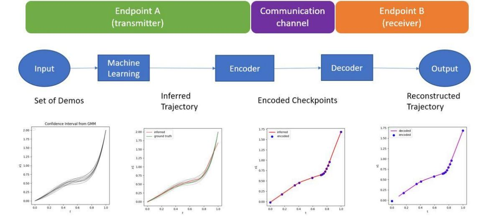
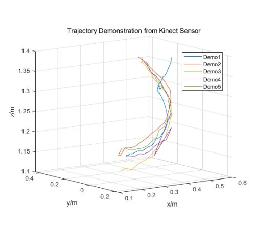
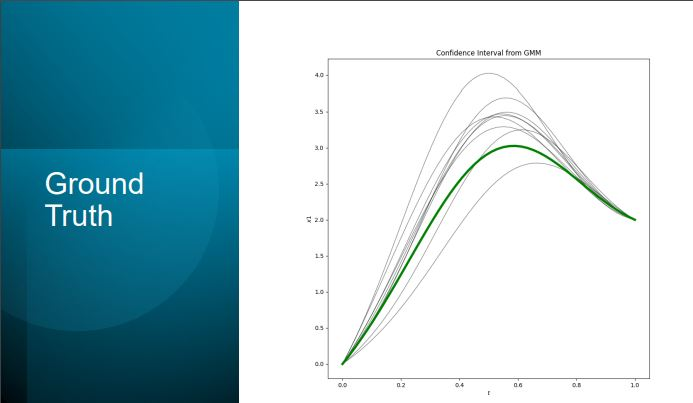
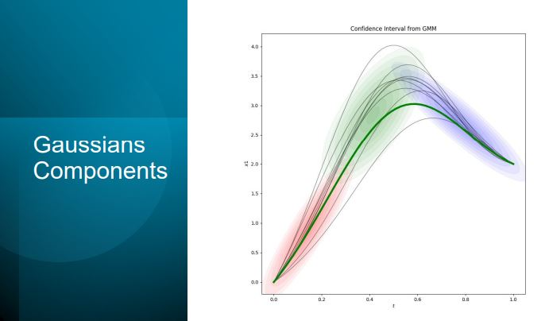
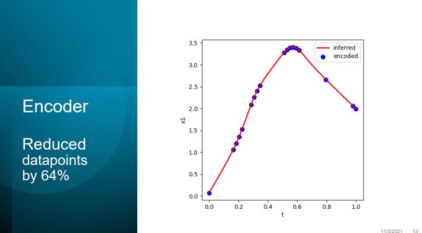
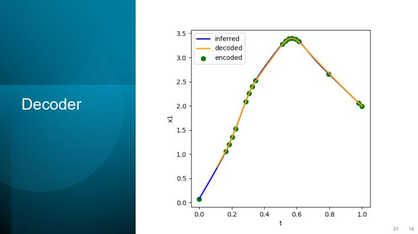

# Imitation Learning for Skill Transfer in Human-Robot Teleoperation.

This research aims at developing a remote control system based on human hand input gestures to enable a faraway robot to replicate human motion with zero latency and high accuracy.
More specifically, to develop an imitation learning system to reproduce skills on robot manipulators with minimal inputs using the Learning by Demonstration (LbD) framework. Human-like input demonstrations are retrieved through a Kinect motion sensor. The experimental results confirm the effectiveness and efficiency of the proposed method when comparing the inferred trajectory to the ground truth.

# Contribution
1. Implement a Gaussian Mixture Model (GMM) to characterize the task trajectory and generate the underlying task trajectory.
2. Build an encoder-decoder system to encode the generated trajectory using minimal inputs.

The system is divided into three main blocks.
- a machine learning model reads a set of few demonstrations as input and fits K-Gaussians to build an internal representation of the underlying geodesic movement. Statistical inferences based on the means of those Gaussians are able to infer the trajectory
- an encoder that compresses the trajectory before transmission
- a decoder that decompresses the trajectory on the received endpoint

:

